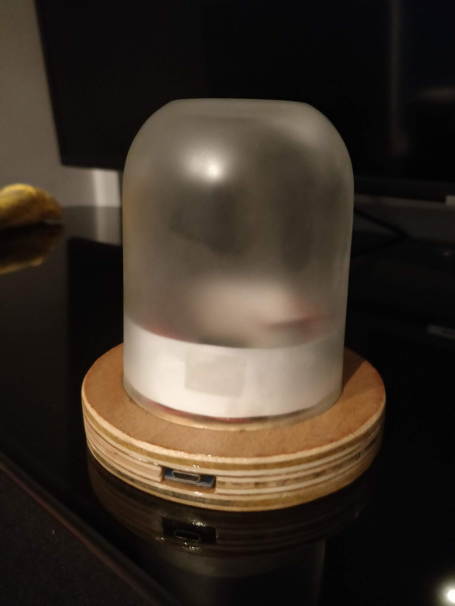
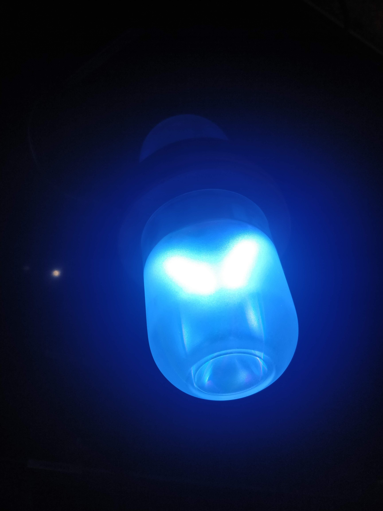
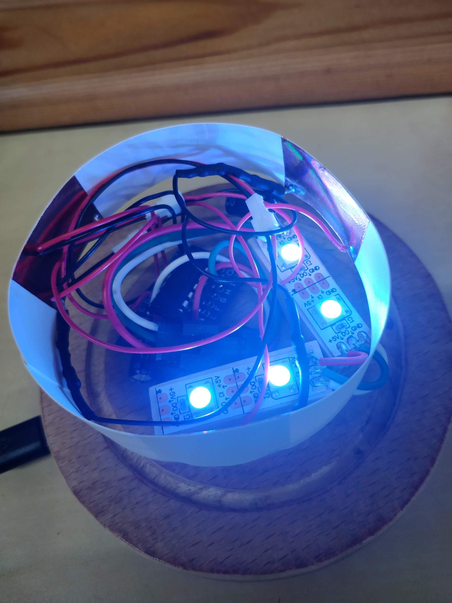
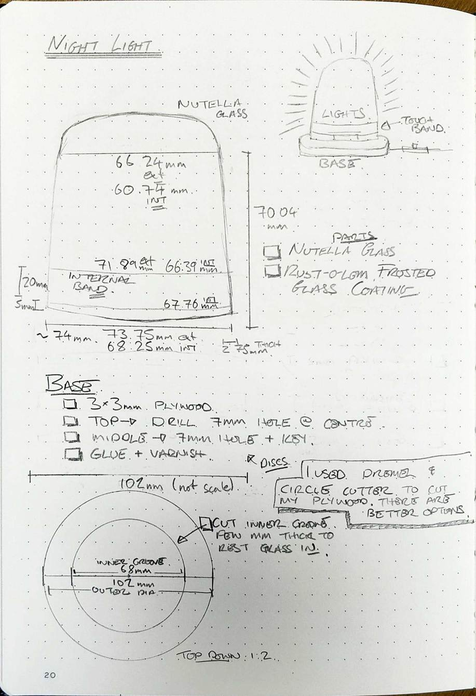
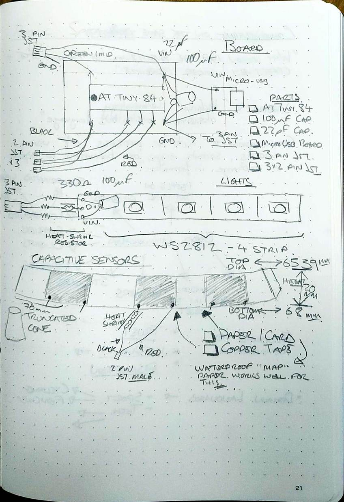

# Nightlight

Maker Nightlight - WS2812, AtTiny84, Capacitance, Arduino.

Looks like this:

<a href="images/photo1.jpg"></a>
<a href="images/photo2.jpg"></a>
<a href="images/photo3.jpg"></a>

## Getting Started

This is a project with a few moving parts, but most of the hard bits are done.  
There's a limited amount of soldering, and some basic general making/wood skills required.  
All soldering is through-hole.

### Prerequisites

Read through the diagram, pull all the parts together.  
Check for sizes, make sure things fit.  
Do do this project in parts - electronics, base, glass housing.
This is the third iteration of this project, I make no guarantee that everything on this diagram is correct.

Plans:

<a href="images/plans1.jpg"></a>
<a href="images/plans2.jpg"></a>

### Installing

```
git clone https://github.com/kianryan/nightlight
```

Open in Arduino IDE.

You'll need a way of flashing directly on to an ATTiny chip.  I use a [USBASP](https://www.fischl.de/usbasp/).

Download the following libraries:

* CaptacitiveSensor
* FastLED

And the following boards:

* [AtTinyCore](https://github.com/SpenceKonde/ATTinyCore)

## Contributing

As far as I'm concerned, this project is _done_.  However, I know there's a few bugs, and if you want to improve - feel free to fork and/or send pull requests.  I may or may not merge.

## Authors

* **Kian Ryan** - [Kian Ryan](https://github.com/kianryan)

## License

This project is licensed under the MIT License - see the [LICENSE.md](LICENSE.md) file for details

## Acknowledgments

* [Adafruit](https://www.adafruit.com/) - No libraries from them, no projects.
* [FastLED](https://github.com/FastLED/FastLED) - Genuinely superb library for turning things on and off again.

